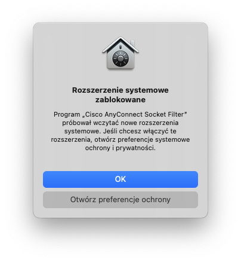
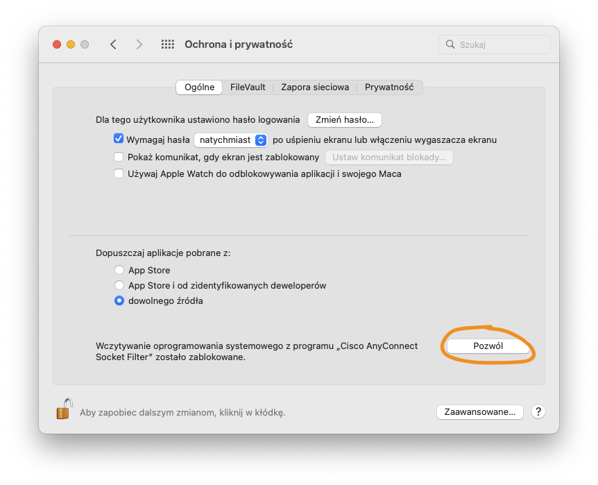
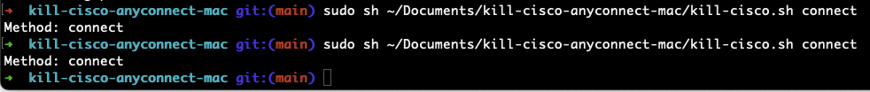

# README #

Kill Cisco AnyConnect for MacOS

### How do I get set up? ###

* Clone repository
### How to use it? ###
* To disconnect:
    * ```sudo sh PATH/TO/REPOSITORY/kill-cisco.sh disconnect```
* To connect again:
    * ```sudo sh PATH/TO/REPOSITORY/kill-cisco.sh connect```
    * Cisco Filter won't start without enabling system extension:
        * ```Settings -> Privacy and Security``` -> Allow
        * So if Cisco Filter is required to establish connection You, for now will need to run ```connect``` twice:
        
        
        

### Who do I talk to? ###

* Grzegorz Zbozień